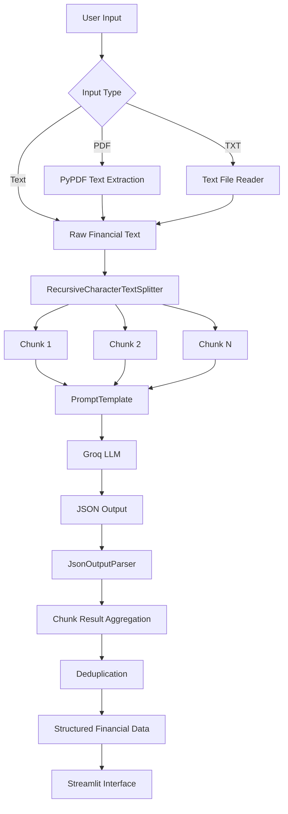

<div align="center">

# 📊 Financial Text Extractor

### LLM-powered financial information extraction from text and earnings transcripts

Turn unstructured financial text, earnings commentary, and PDF transcripts into structured financial insights using **LangChain + Groq + Streamlit**.

<br>


<br>

**Built as a hands-on learning project to understand how LLM applications work end-to-end.**

</div>

---

## 📌 Overview

Financial reports and earnings transcripts contain useful information, but most of it exists as unstructured text.

This project converts that text into structured information using an LLM.

The application accepts:

- Financial news or earnings text pasted manually
- Earnings-call transcript PDFs
- TXT files
- Long financial transcripts

It then extracts key financial metrics, business developments, management commentary, risks, and other important information.

---

## 🎯 Project Goal

The objective of this project was not to build a production-grade financial research platform.

It was built to understand the fundamental architecture behind an **LLM-powered application**:

```text
User Input
    ↓
Prompt Template
    ↓
LLM
    ↓
Structured Output
    ↓
Output Parser
    ↓
Python Processing
    ↓
Streamlit Application
```

During development, the project was later extended to handle long documents using **text chunking, overlapping context, multi-call extraction, result aggregation, and API rate-limit handling**.

---

## ✨ Features

### 📈 Financial Information Extraction

The application extracts:

| Field | Example |
|---|---|
| Company | Carborundum Universal Limited |
| Reporting Period | Q1 FY27 |
| Revenue Actual | ₹1,411 crore |
| Revenue Expected | ₹1,350 crore |
| Revenue Growth | 16.9% YoY |
| EPS Actual | ₹12.40 |
| EPS Expected | ₹11.80 |
| Profit Growth | 23.4% |
| Margin | 16.2% |
| Margin Change | Improved from 14.8% to 16.2% |
| Capex | ₹300 crore |
| Capacity Expansion | 25% |
| Management Guidance | Revenue growth expected at 15–18% |
| Key Positive | Margin improvement |
| Key Risk | Higher raw-material prices |

Missing information is returned as:

```text
Not Mentioned
```

instead of being intentionally inferred.

---

## 🆕 What's New Detection

The application also identifies important new developments mentioned by management or in financial commentary.

Examples include:

```text
Acquisition
Management Change
New CEO / CFO / Director
New Product
Product Launch
New Order
Contract Win
New Client
Partnership
Joint Venture
Capex
Capacity Expansion
New Plant
New Facility
New Market
New Geography
New Business Segment
Investment
Fund Raising
Technology Development
Strategic Initiative
```

Each detected development is returned with a category and description.

Example:

| Category | Development |
|---|---|
| New Product | Company plans to launch two EV-related products |
| Capacity Expansion | Manufacturing capacity will increase by 25% |
| Capex | ₹300 crore investment announced |
| Management Change | New CFO appointed |
| New Order | Company secured a major export contract |

---

## 🎙️ Transcript Signals

The application also performs deterministic transcript analysis.

Currently it counts occurrences of:

```text
"congratulations"
```

This is deliberately calculated using **Python regex instead of an LLM**.

```python
re.findall(
    r"\bcongratulations\b",
    text,
    flags=re.IGNORECASE
)
```

This demonstrates an important LLM application principle:

> Use an LLM for tasks that require language understanding.  
> Use normal programming for tasks that can be solved deterministically.

---

## 📄 Supported Input

The Streamlit interface currently supports:

| Input | Supported |
|---|---:|
| Manual text | ✅ |
| `.pdf` transcript | ✅ |
| `.txt` file | ✅ |
| Long transcripts | ✅ |
| Scanned/image-only PDF | ❌ OCR not implemented |

PDF text is extracted using **PyPDF**.

---

## 🧠 How It Works



---

## 🔗 LangChain Pipeline

The core LangChain pipeline is intentionally simple:

```python
chain = prompt_template | llm | parser
```

Conceptually:

```text
PromptTemplate
      ↓
     LLM
      ↓
JsonOutputParser
```

The chain is invoked using:

```python
result = chain.invoke({
    "text": financial_text
})
```

The final output becomes a standard Python dictionary rather than unstructured LLM text.

---

## 🤖 LLM

The project currently uses:

```text
Provider: Groq
Model: openai/gpt-oss-20b
```

Through LangChain:

```python
from langchain_groq import ChatGroq

llm = ChatGroq(
    model="openai/gpt-oss-20b",
    temperature=0
)
```

A low temperature is used because this is primarily an **information-extraction task**, where consistency is more useful than creativity.

---

## 🧩 Why Chunking Was Needed

Initially, the complete transcript was sent directly to the model.

A real earnings transcript contained approximately:

```text
52,000+ characters
8,000+ words
```

The request exceeded the API's available token-processing limits.

Instead of reducing the transcript manually, the application was redesigned to process long documents in chunks.

The application uses:

```python
RecursiveCharacterTextSplitter
```

with overlapping text.

Conceptually:

```text
Large Transcript
      ↓
┌─────────────┐
│   Chunk 1   │
└─────────────┘
      ↓
┌─────────────┐
│   Chunk 2   │
└─────────────┘
      ↓
┌─────────────┐
│     ...     │
└─────────────┘
      ↓
┌─────────────┐
│   Chunk N   │
└─────────────┘
```

Each chunk is processed independently.

The results are then merged into one final result.

---

## 🔁 Chunk Overlap

Adjacent chunks contain a small overlap.

For example:

```text
Chunk 1
-------------------------------------------------
The company announced a new manufacturing facility...

                           ↓ overlap ↓

Chunk 2
...new manufacturing facility with an investment
of ₹300 crore and expected capacity expansion...
```

This helps preserve context when information appears near a chunk boundary.

---

## 🧬 Result Aggregation

Different fields require different aggregation strategies.

### Single-value fields

Examples:

```text
Company
Reporting Period
Revenue
EPS
Margin
```

The application keeps the first meaningful value found.

### Multi-value fields

Examples:

```text
Capex
Management Guidance
Key Positives
Key Risks
Capacity Expansion
```

Multiple unique values can be collected across transcript chunks.

### New developments

New developments are stored as:

```json
{
  "category": "New Product",
  "detail": "The company plans to launch two EV-related products."
}
```

Duplicate developments are removed during aggregation.

---

## 🛡️ Hallucination Control

The extraction prompt explicitly instructs the model to:

```text
Extract only information supported by the supplied text.
Do not guess or invent information.
Return "Not Mentioned" when a field is unavailable.
```

Example:

```json
{
  "eps_actual": "Not Mentioned",
  "eps_expected": "Not Mentioned"
}
```

instead of asking the model to estimate missing values.

---

## 📂 Project Structure

```text
financial-text-extractor/
│
├── notebooks/
│   └── 01_llm_financial_extraction.ipynb
│
├── src/
│   ├── __init__.py
│   └── extractor.py
│
├── app.py
├── requirements.txt
├── README.md
├── .gitignore
├── .env
└── .venv/
```

### Important

The following are intentionally excluded from Git:

```text
.env
.venv/
__pycache__/
.ipynb_checkpoints/
*.pyc
```

---

<details>

<summary><b>📁 What each file does</b></summary>

<br>

### `app.py`

Contains the Streamlit frontend.

Responsible for:

```text
Text input
PDF/TXT upload
Progress tracking
Displaying results
Displaying transcript signals
Displaying new developments
```

### `src/extractor.py`

Contains the backend LLM pipeline.

Responsible for:

```text
PromptTemplate
Groq LLM
JSON parsing
Text splitting
Chunk processing
Result merging
Deduplication
Congratulations count
DataFrame creation
```

### `notebooks/01_llm_financial_extraction.ipynb`

Contains the learning and experimentation workflow used before converting the logic into application code.

### `.env`

Stores the Groq API key locally.

It must never be committed to GitHub.

</details>

---

## ⚙️ Installation

### 1. Clone the repository

```bash
git clone https://github.com/Krushang010/financial-text-extractor.git
```

```bash
cd financial-text-extractor
```

---

### 2. Create a virtual environment

Windows:

```bash
py -3.11 -m venv .venv
```

Activate using CMD:

```bash
.venv\Scripts\activate
```

Activate using PowerShell:

```powershell
.\.venv\Scripts\Activate.ps1
```

---

### 3. Install dependencies

```bash
pip install -r requirements.txt
```

---

### 4. Configure the API key

Create:

```text
.env
```

inside the project root.

Add:

```env
GROQ_API_KEY=your_groq_api_key_here
```

Never commit the `.env` file.

---

### 5. Run the application

```bash
streamlit run app.py
```

Streamlit will open the application in your browser.

---

## 🔐 Environment Variables

Recommended setup:

```env
GROQ_API_KEY=your_api_key_here
```

For public repositories, consider also creating:

```text
.env.example
```

containing:

```env
GROQ_API_KEY=your_groq_api_key_here
```

This tells other users what environment variable they need without exposing your real credential.

---

## 🖥️ Application Workflow

```text
Upload PDF / Paste Text
          ↓
Extract Text
          ↓
Count Transcript Signals
          ↓
Split Long Text
          ↓
Process Chunk 1
          ↓
Process Chunk 2
          ↓
       ...
          ↓
Process Chunk N
          ↓
Merge Results
          ↓
Remove Duplicates
          ↓
Display Financial Information
          ↓
Display What's New
```

---

## 🧪 Example Input

```text
ABC Electronics Ltd reported Q2 FY27 revenue of ₹1,250 crore,
up 18% year-on-year compared with analyst expectations of
₹1,180 crore.

EPS came in at ₹12.40 versus expectations of ₹11.80.

EBITDA margin improved to 16.2% from 14.8% last year.

The company announced a ₹300 crore investment to expand
manufacturing capacity by 25% and plans to launch two
EV-related products next quarter.

Management expects FY27 revenue growth of 15% to 18%.

Higher raw-material prices remain a near-term risk.
```

---

## 📤 Example Output

```json
{
  "company": "ABC Electronics Ltd",
  "reporting_period": "Q2 FY27",
  "revenue_actual": "₹1,250 crore",
  "revenue_expected": "₹1,180 crore",
  "revenue_growth": "18% YoY",
  "eps_actual": "₹12.40",
  "eps_expected": "₹11.80",
  "margin": "16.2%",
  "margin_change": "14.8% to 16.2%",
  "capex": "₹300 crore",
  "capacity_expansion": "25%",
  "management_guidance": "FY27 revenue growth of 15% to 18%",
  "key_risk": "Higher raw-material prices"
}
```

The Streamlit application presents this as structured tables rather than exposing raw JSON to the end user.

---

## 🛠️ Tech Stack

| Technology | Purpose |
|---|---|
| Python | Core application language |
| LangChain | LLM orchestration |
| Groq | LLM inference provider |
| GPT-OSS 20B | Language model |
| PromptTemplate | Dynamic prompt construction |
| JsonOutputParser | Structured model output |
| RecursiveCharacterTextSplitter | Long-document chunking |
| PyPDF | PDF text extraction |
| Pandas | Structured tabular output |
| Streamlit | Web application interface |
| python-dotenv | Environment-variable management |

---

## 📚 Concepts Learned

This project was intentionally built step-by-step to understand the fundamentals behind LLM applications.

```text
LLM invocation
Prompt engineering
PromptTemplate
LangChain chains
Pipe operator ( | )
Structured JSON output
JsonOutputParser
Environment variables
API keys
API rate limits
Context windows
Token limits
Long-document chunking
Chunk overlap
Result aggregation
Deduplication
PDF extraction
Deterministic vs LLM tasks
Streamlit integration
```

---

<details>

<summary><b>🧠 Key Learning: Context Window vs API Rate Limits</b></summary>

<br>

One important issue encountered during development was a request failing even though the model could theoretically understand the full document.

These are different concepts:

```text
Context Window
=
How much information the model can theoretically process at once
```

versus:

```text
API Rate Limit
=
How many tokens the API account is allowed to process
within a particular period
```

This is why chunking was required even though the underlying model supported a larger context window.

</details>

---

<details>

<summary><b>🧠 Key Learning: Why use an Output Parser?</b></summary>

<br>

An LLM normally returns text.

For example:

```text
Company: ABC Ltd
Revenue: ₹500 crore
Growth: 20%
```

Applications work better with predictable structured data:

```python
{
    "company": "ABC Ltd",
    "revenue": "₹500 crore",
    "growth": "20%"
}
```

`JsonOutputParser` converts the LLM-generated JSON text into a Python dictionary that can be processed programmatically.

</details>

---

<details>

<summary><b>🧠 Key Learning: Why PromptTemplate?</b></summary>

<br>

Instead of manually constructing prompts repeatedly:

```python
prompt = f"""
Analyze this text:

{text}
"""
```

LangChain allows a reusable template:

```python
prompt_template = PromptTemplate.from_template(prompt)
```

which becomes a component of the pipeline:

```python
chain = prompt_template | llm | parser
```

</details>

---

## ⚠️ Current Limitations

This project is intentionally lightweight.

Current limitations include:

```text
No OCR for scanned PDFs
No database
No vector database
No RAG
No embeddings
No document persistence
No authentication
No financial fact verification against external sources
Chunk aggregation uses relatively simple rules
LLM outputs may still occasionally require validation
API processing speed depends on provider rate limits
```

The application should therefore be treated as an **LLM learning project**, not a financial decision-making system.

---

## 🚀 Possible Future Improvements

Potential future extensions include:

```text
Pydantic structured output
More robust retry logic
LLM-based result consolidation
Semantic deduplication
OCR support
Multiple document comparison
Speaker-level transcript analysis
Management vs analyst segmentation
Sentiment analysis
Topic extraction
Embeddings
Vector database
Semantic search
RAG
Historical quarter comparison
Export to CSV / Excel
Model switching
Token and API cost monitoring
```

These are intentionally outside the current project scope.

---

## 🔒 Security

Never commit API keys directly into source code.

Bad:

```python
GROQ_API_KEY = "gsk_xxxxxxxxx"
```

Correct:

```python
from dotenv import load_dotenv

load_dotenv()
```

with the key stored inside:

```text
.env
```

and `.env` included in `.gitignore`.

---

## 📖 Learning Journey

This project was developed incrementally.

```text
1. Direct LLM call

2. PromptTemplate

3. PromptTemplate + LLM

4. JSON output

5. JsonOutputParser

6. LangChain chain

7. Financial field extraction

8. Streamlit UI

9. PDF transcript support

10. New-development extraction

11. Long-document chunking

12. API rate-limit handling

13. Chunk aggregation

14. Duplicate removal

15. Transcript signal extraction
```

This incremental approach made it possible to understand each component before combining everything into the final application.

---

## 👨‍💻 Author

**Krushang Patel**

Data Scientist focused on building practical machine-learning, NLP, forecasting, risk, and decision-intelligence applications.

[](https://github.com/Krushang010)

[](https://www.linkedin.com/in/krushang-patel-data-scientist)

---

## ⭐ Support

If you found this project useful or interesting, consider giving the repository a ⭐.

<div align="center">

### Built to learn how real LLM applications move from

**Prompt → Model → Structured Output → Application**

</div>